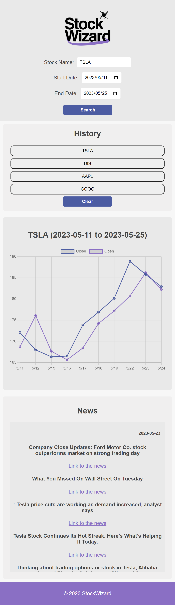
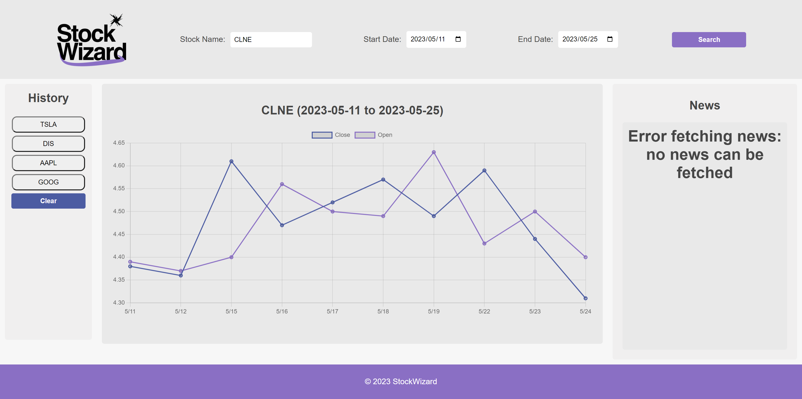

# Description of the project

The challenge of this project was to work collaboratively with other developers to create a project that solves a real-world problem. The project did it have a user story or an acceptance criterion. The project needed to fulfil the following requirements: use CSS, be interactive, use at least two server-side API’s, client storage, does not use alerts, be responsive, have a polished UI, have a clean repository.

[Link to the project](https://dylanadams98.github.io/stock-wizard/)

# Technologies used

The following technologies were used within the code to achieve the desired website:

- HTML/CSS
- JavaScript
- Day JS
- Chart JS
- Local Storage
- Polygon API
- News API

# APIs

For the project, the two API’s that were used are Polygon which is a stock market API that gathers real time stock prices. We combined it with a News API’s that enabled data from thew news about that specific ticker. By combing the two data’s from these specific API’s it enables the user to access a specific ticker and the news about that ticker in line with price discovery. As the breaking news come in, stock prices react. This will enable the user to decide how stock prices will be affected, thus thinking about their next investment.

## Polygon.io - Stock Market Data APIs

Free stock data APIs. Real time and historical data, unlimited usage, tick level and aggregate granularity, in standardized JSON and CSV formats. Plus currencies data, including forex, crypto, and more.
[Link of polygon API](https://polygon.io)

## News APINews API

News API – Search News and Blog Articles on the Web
Get JSON search results for global news articles in real-time with our free News API.
[Link of News API](https://newsapi.org/)

# Components of the web page

## Header

It contains three input fields. One for inputting the code of stock, the other twos for selecting the start and end dates of a period. Also a search button to click to make query.

## Chart container

It shows a chart to visualize the trend of stock price data drawn from Polygon API

## News Container

It shows news relating to the stock, drawn from the News API

## History Container

It saves the search history of users. Each history is a button. By clicking each button, the chart and news of the stock will be shown.

# ScreenShots

A link to the GitHub Repo down below:
[Link to the github](https://github.com/dylanadams98/bootcamp-project-1)

See a picture of the website down below:

When the webpage is responsive:

Handling error of Polygon API:

Handling error of News API:

# Presentation

[Link to the presentation](./assets/presentation/StockWizardHQ.pptx)
